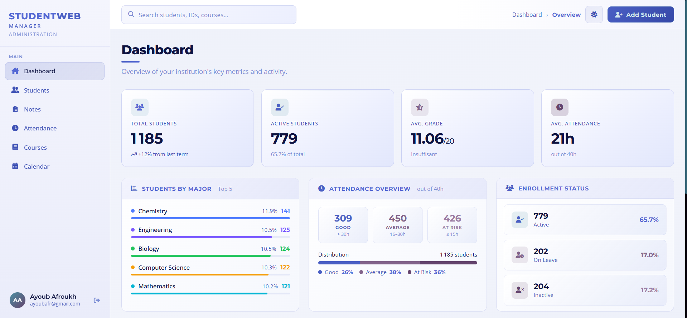
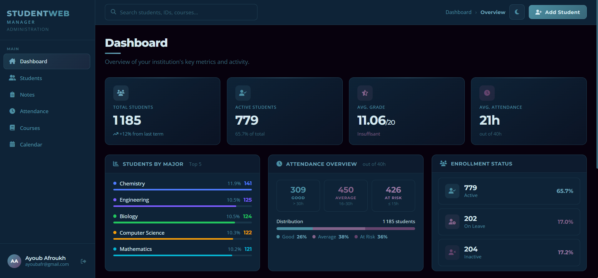
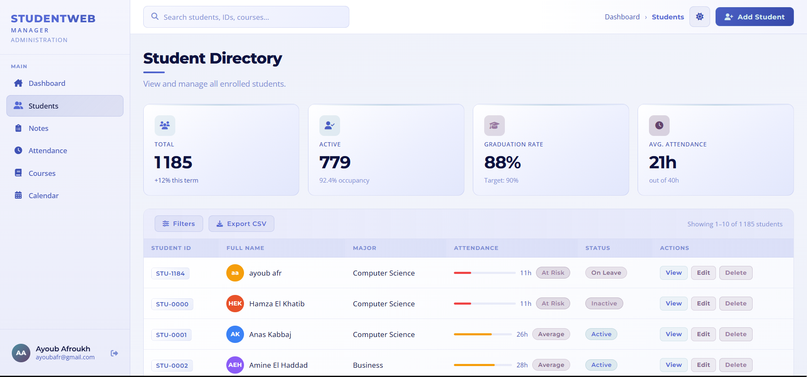
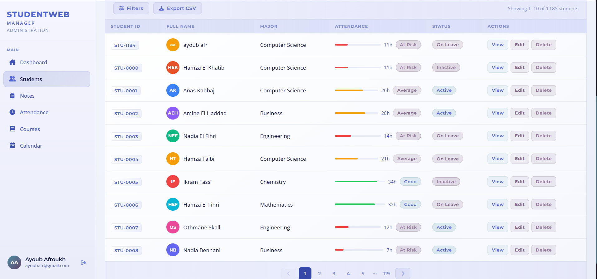
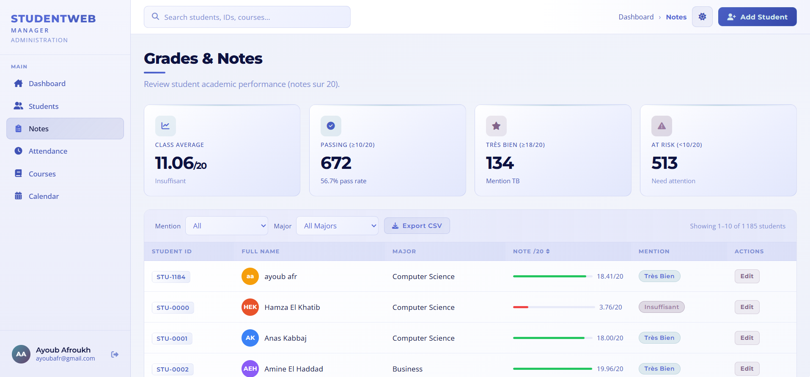
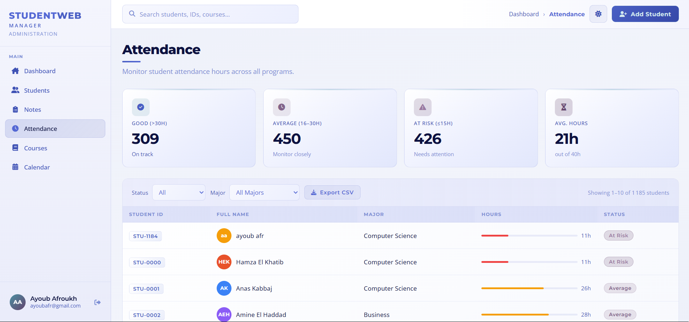
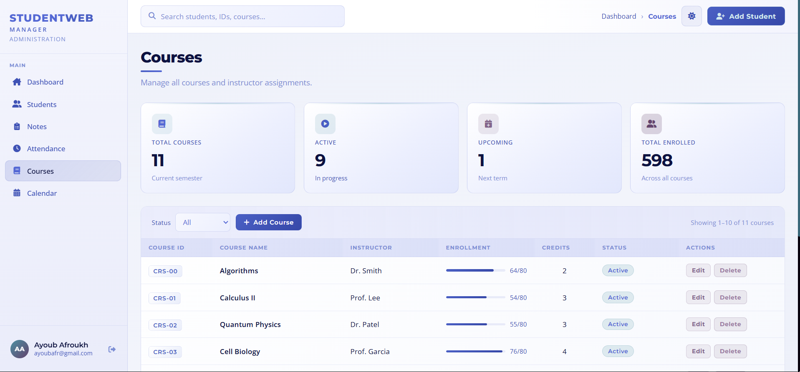
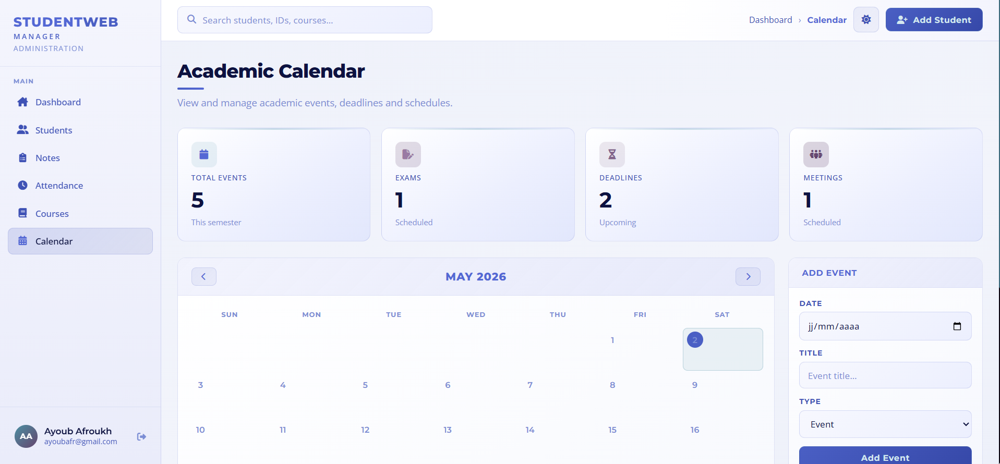
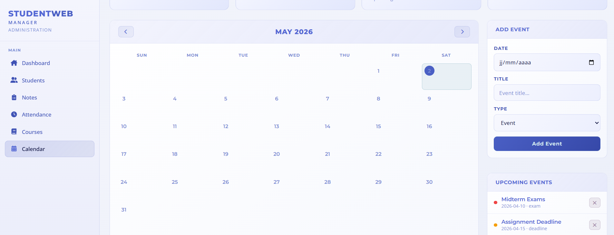

# 📚 Gestionnaire d'Étudiants
#  🎓 StudentWeb Manager - Documentation UI & Stockage

Ce document présente l’ensemble des interfaces de l’application **StudentWeb Manager** , un tableau de bord destiné aux administrateurs et managers d’établissements scolaires.  
Toutes les données affichées (étudiants, notes, présence, cours, événements) sont **stockées dans le `localStorage` du navigateur**, ce qui permet une démonstration autonome sans base de données externe.
## Interface principale

*La page d'accueil de l'application*

* L'application supporte **le mode nuit / dark mode** sur l'ensemble des pages (Dashboard, Students, Notes, Attendance, Courses, Calendar, Login).


## Ajout d'un étudiant
*Le formulaire d'ajout d'étudiant*


## Annuaire étudiants 
*Tableau listant les étudiants avec ID, nom, filière, présence, statut et actions (Voir, Modifier, Supprimer).  
Filtres et bouton d'export CSV disponibles.*



## Gestion des notes
*Tableau des notes sur 20 avec mentions (Très Bien, Insuffisant).  
Moyenne générale et taux de réussite affichés en haut de page.*


## Gestion de l'assiduité 
*Statistiques de présence par tranche (Bon, Moyen, À risque) avec graphique textuel.  
Tableau des heures de présence par étudiant avec statut associé*


## Gestion des cours
*Liste des cours avec ID, nom, enseignant, inscriptions, crédits et statut.  
Bouton "+Add Course" pour ajouter un nouveau cours dans le localStorage.*


## Calendrier académique simplifié
*Vue mensuelle avec formulaire d'ajout d'événement (date, titre, type).  
Liste des événements à venir (examens, deadlines, réunions).*



## Écran de connexion
*Choix du rôle (Teacher / Admin) avec champs email et mot de passe.  
Citation pédagogique et lien vers conditions d'utilisation.*


## 🛠️ Technologies utilisées

- HTML5
- CSS3
- JavaScript
  Ce projet a été développé avec l'assistance (IA) pour :
- la conception des interfaces (CSS)
- L'écriture des scripts JavaScript pour la gestion du localStorage, filtres ..
- Le débogage et l'optimisation du code

## 📂 Fichiers

- `index.html` - Structure de la page
- `style.css` - Styles et mise en page  
- `app.js` - Logique de l'application

## 🚀 Comment l'utiliser

1. Clone le dépôt :
   ```bash
   git clone https://github.com/ayoub3300afr-prog/students-manager.git
