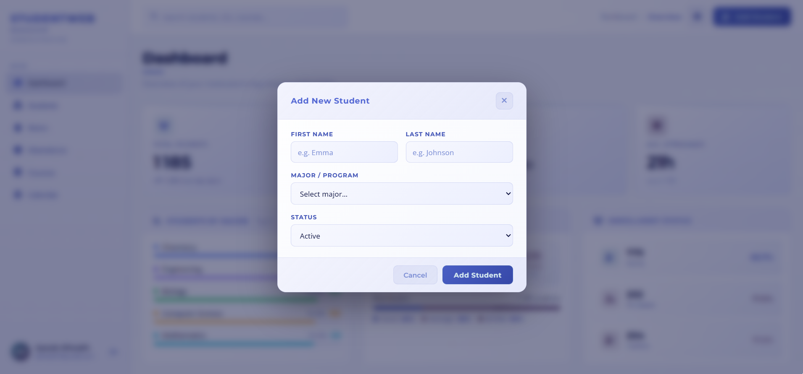
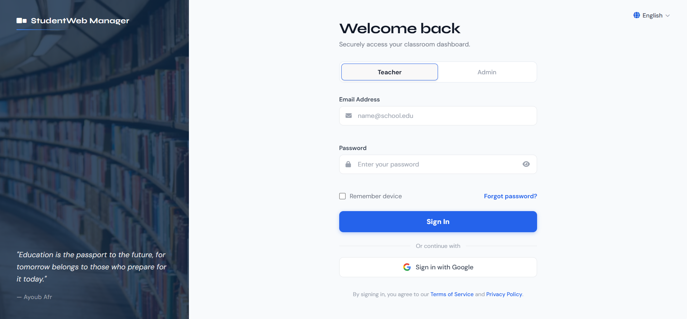

# 📚 Gestionnaire d'Étudiants

# Gestionnaire d'Étudiants

## Interface principale

*La page d'accueil de l'application*

## Ajout d'un étudiant



.png)


.png)

*Le formulaire d'ajout d'étudiant*

Application web simple pour gérer une liste d'étudiants.

## 🖼️ Captures d'écran


## ✨ Fonctionnalités

- Ajouter un étudiant
- Afficher la liste
- Supprimer un étudiant (à venir)

## 🛠️ Technologies utilisées

- HTML5
- CSS3
- JavaScript

## 📂 Fichiers

- `index.html` - Structure de la page
- `style.css` - Styles et mise en page  
- `app.js` - Logique de l'application

## 🚀 Comment l'utiliser

1. Clone le dépôt :
   ```bash
   git clone https://github.com/ayoub3300afr-prog/students-manager.git
